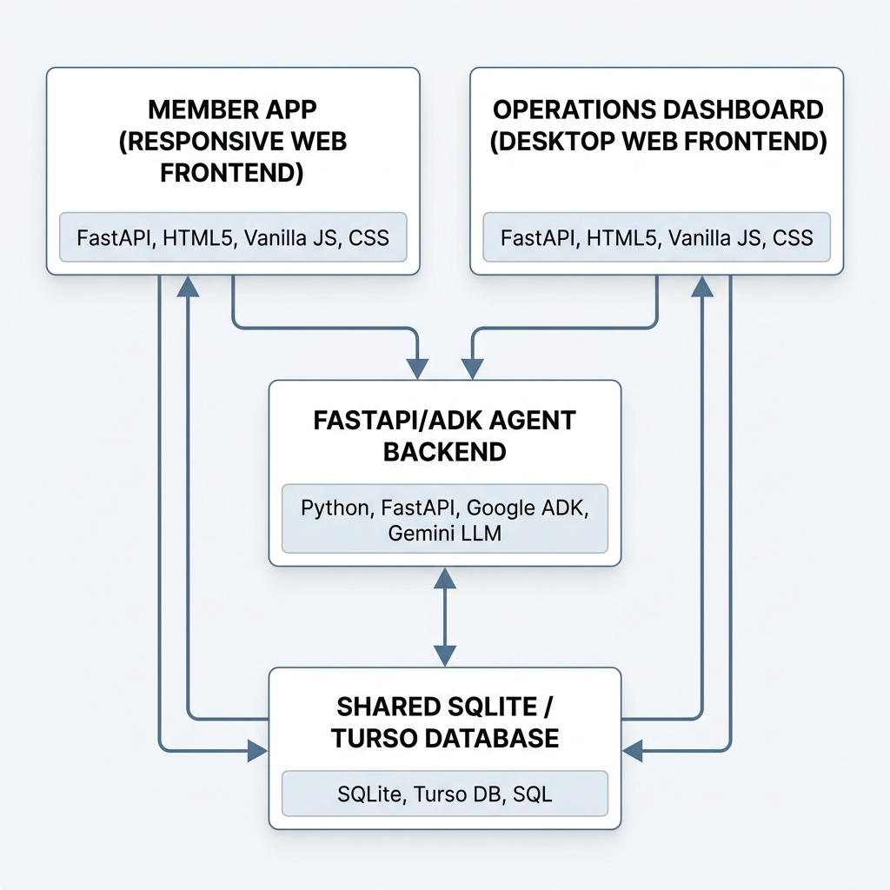
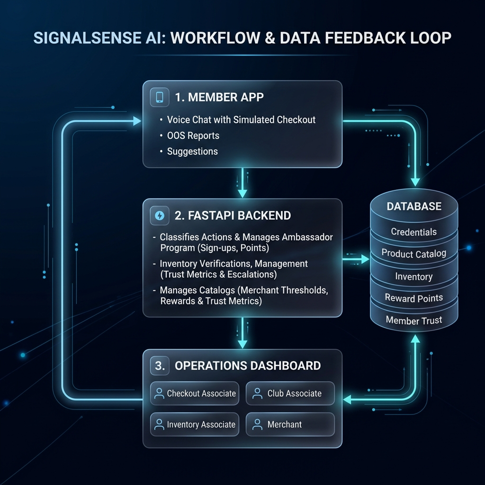
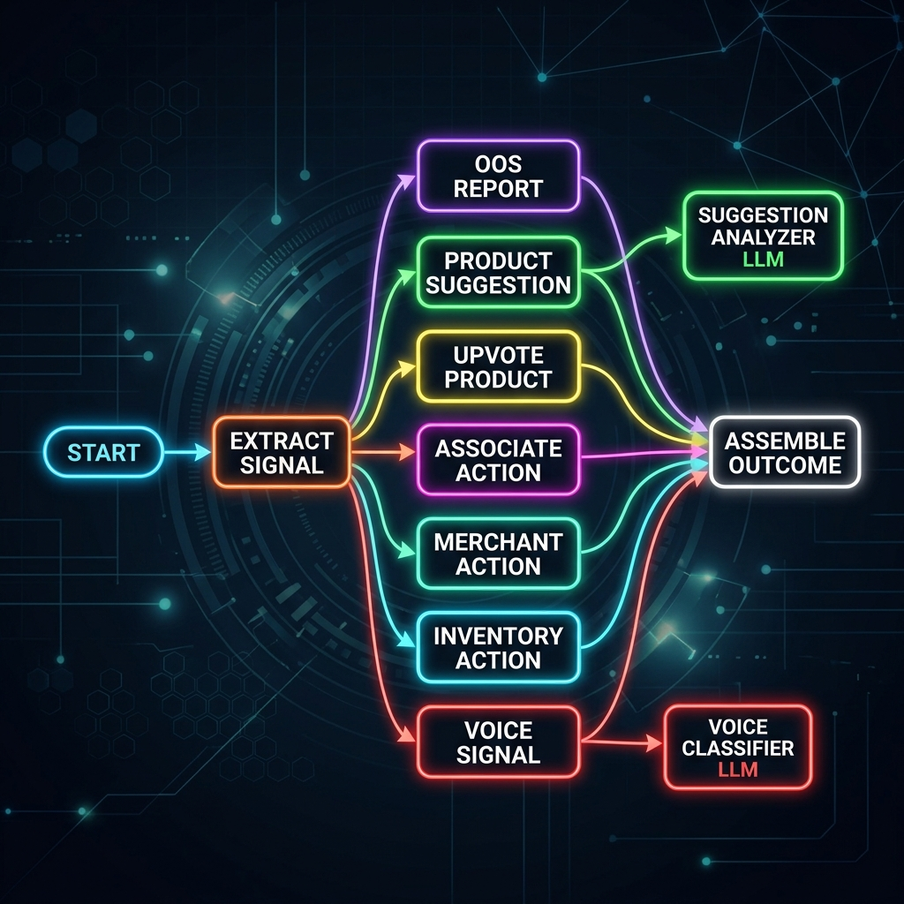
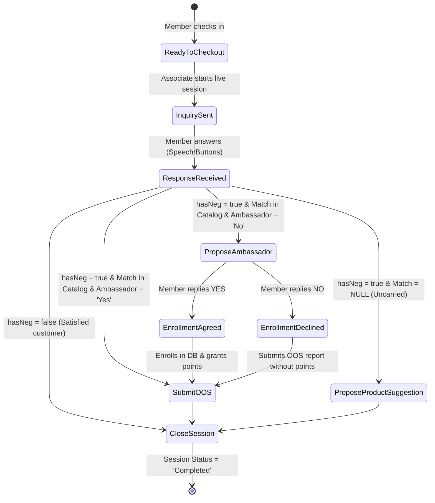

# SignalSense AI: Decoupled Agent-Driven Retail Inventory Optimizer

SignalSense AI is an enterprise-grade, agent-driven retail optimization platform designed to eliminate the retail "shelf gap" (out-of-stock items) by connecting members, checkout associates, and merchants in real-time. 

Built on the **Google Agent Development Kit (ADK)** and Gemini, the platform turns customers into "Ambassadors" who report missing items or propose new product suggestions using voice signals, earning rewards in return.

---

## 📖 Table of Contents
1. [The Problem](#-the-problem)
2. [The Solution](#-the-solution)
3. [Architecture Overview](#-architecture-overview)
4. [Agentic Workflows & State Machine](#-agentic-workflows--state-machine)
5. [Core Platform Improvements](#-core-platform-improvements)
6. [Local Setup & Launch Guide](#-local-setup--launch-guide)
7. [Testing & Verification](#-testing--verification)
8. [Capstone Course Concepts Used](#-capstone-course-concepts-used)

---

## 🚨 The Problem

Traditional retail inventory tracking suffers from latency:
* **The Shelf Gap:** Store inventory systems often show items as "in-stock" (based on POS data or shipping logs) when the physical shelves are actually empty or misplaced, leading to lost sales.
* **Disconnected Feedback Loops:** Customers who cannot find an item leave dissatisfied without any record of the missing item ever reaching store associates or merchants.
* **Vibe-Coded Fragility:** Prototypical AI integrations are often tightly coupled, fragile, and fail silently in restricted network environments or sandboxes.

---

## ✨ The Solution

**SignalSense AI** solves these issues through a decoupled, state-machine-driven microservices architecture:
1. **Live Checkout Assistant:** A real-time voice-interactive checkout overlay. It parses member responses using Chrome's Speech Recognition & Synthesis APIs.
2. **Ambassador Program Integration:** Automatically checks member profiles. Non-Ambassadors reporting stock-outs are prompted via voice to enroll on the spot to earn reward points.
3. **Smart Product Suggestions:** If a member reports a missing item that the store doesn't carry (e.g., *Kimchi*), the system automatically routes the request as a new product recommendation instead of an OOS report, letting merchants review it.
4. **Decoupled Architecture:** Frontend applications communicate with the backend ADK Agent via standalone HTTP APIs, backed by a resilient in-process fallback runner.

---

## 🏗️ Architecture Overview

The system is decoupled into three independent microservices that communicate over HTTP and share a unified database:



### 🔄 Bi-Directional System Signal Loop

Beyond individual microservice bounds, the platform operates as a closed-loop system coordinating member inputs and operational associate tasks:



1. **Signal Ingestion:** Members interact at the checkout counter (assisted by the **Checkout Associate** via live voice sessions) or submit OOS reports and product suggestions via the Member App, triggering REST signals to the FastAPI backend.
2. **Context Parsing & Backend Logic:** The backend queries the shared database to verify credentials, resolve inventory, and manage **Ambassador programs (including sign-ups, reward points, and Member Trust metrics)**. It then inserts pending tasks or suggestions.
3. **Operational Resolution:** Store associates act on signals via the Operations Dashboard:
   * **Checkout Associates** orchestrate live checkout voice counter coordination.
   * **Club Associates** perform physical shelf and backroom verifications.
   * **Inventory Associates** manage stock replenishments and distribution center transfers.
   * **Merchants** manage catalogs including merchant reporting thresholds, rewards, and trust metrics.
   Resolutions dispatch action signals back to the backend.
4. **Outcome Commit:** The backend processes associate inputs (completing shelf audits, managing inventory verifications, management including trust metrics and escalations, or approving suggestions), writes the final state back to the database, and updates Ambassador rewards.

### Decoupling & Sandboxed Resiliency
* **Stand-Alone HTTP APIs:** The Member App and Dashboard run as separate FastAPI services. They communicate with the ADK agent running as a standalone runtime app.
* **In-Process Fallback:** If the standalone backend is offline, both frontends gracefully fall back to executing the ADK agent **in-process** via a local `Runner` instance. This ensures the app is self-healing and operates successfully in sandboxed CI/CD testing environments.

---

## 🤖 Backend ADK Agent Graph Workflow

Inside the backend agent, execution follows a strict directed graph defined using the **Google Agent Development Kit (ADK)**:



---

## 🔄 Agentic Workflows & State Machine

The Live Checkout Assistant operates on a coordinated state machine:



---

## 🚀 Core Platform Improvements

We have significantly enhanced the prototype with production-grade engineering improvements across three main areas:

### 1. Security Framework (JWT-Based RBAC)
* **Role-Based Access Control:** Implemented signed **JSON Web Tokens (JWT)** to secure all sensitive backend API endpoints and Associate Dashboard routing paths.
* **Access Restricting:** Ensures that only authorized users with verified roles (e.g. `Club_Associate`, `Merchant`, `Inventory_Associate`, or `Checkout_Associate`) can access internal task boards, replenish inventories, or approve product suggestions, preventing privilege escalation.

### 2. Live Voice Checkout Coordination
* **Dynamic Dialogue Routing:** Orchestrated a live voice session coordinator between the associate and member browsers. It handles real-time polling synchronizations every **400ms** to transition layouts instantly.
* **Chrome Speech Synthesis/Recognition Integration:** Integrated native browser Text-to-Speech (TTS) and speech recognition.
* **Windows & Chrome Compatibility:** Fixed garbage-collection and `onend` callback bugs in Windows Chrome speech engines by implementing a global utterance store and a safety watchdog timer.
* **Contraction Normalization:** Added regex text normalizers to sanitize smart/curly apostrophes (`’` ➔ `'`), preventing voice-dictated tokens like `couldn't` or `wasn't` from failing intent parsing.
* **Interactive Enrollment:** Non-Ambassadors reporting stock-outs are dynamically prompted to voice-enroll in the program on the spot, writing points and Ambassador updates directly to the database.

### 3. Testing & Spec-Driven Development (SDD)
* **Decoupled Test Suite:** Expanded unit testing in `test_checkout_states.py` to assert the state machine transitions, uncarried suggestions, duplicate reports, and point-awarding logic in less than 0.05 seconds.
* **Integration Harness:** Provided `verify_harness.py` to spin up the standalone backend microservice, run test sessions through the FastAPI test client, verify DB changes, and tear down processes automatically, validating the entire microservices contract.

---

## 💻 Local Setup & Launch Guide

### Prerequisites
* Python 3.12+
* Google Cloud CLI (if deploying to Cloud Run)

### 1. Initialize Virtual Environment & Dependencies
```bash
# Install dependencies
uv sync
```

### 2. Seed the Database
```bash
# Seeds the database with default members, items, and rules
uv run python enterprise_db/seed_db.py
```

### 3. Run the Backend ADK Agent
In a separate terminal window, start the standalone backend agent:
```bash
PYTHONPATH="signalsense_enterprise" uv run python signalsense_enterprise/signalsense_agent/fast_api_app.py
```

### 4. Start the Frontend Applications
In another terminal, start the Member Ambassador App (Port 8083):
```bash
PYTHONPATH="signalsense_enterprise:member_ambassador_app" uv run python -m uvicorn member_ambassador_app.main:app --host 127.0.0.1 --port 8083 --reload
```
In a third terminal, start the Operations Dashboard (Port 8085):
```bash
PYTHONPATH="signalsense_enterprise:operations_dashboard" uv run python -m uvicorn operations_dashboard.main:app --host 127.0.0.1 --port 8085 --reload
```

---

## 🧪 Testing & Verification

### Run Unit Tests
We maintain an automated verification suite that validates state machine transitions, edge cases, and routing logic:
```bash
env GEMINI_API_KEY=dummy GOOGLE_GENAI_USE_ENTERPRISE= PYTHONPATH=signalsense_enterprise:member_ambassador_app:operations_dashboard .venv/bin/python -m unittest test_checkout_states.py
```

### Pre-commit & Linter Checks
We ensure code quality using code formatters and linting suites:
```bash
# Run the local python linter suite
.venv/bin/python lint_project.py
```

---

## 🎓 Capstone Course Concepts Used

This project applies the following core concepts from the **5-Day GenAI & AI Agents Course**:
1. **Model Context Protocol (MCP):** Connects the agent dynamically to documentation and reference guidelines, bypassing hardcoded rules.
2. **Agent-to-UI Integration (A2UI):** Dynamic HTML/JS rendering where the user interface responds directly to backend state updates and voice/speech synthesis processes.
3. **Agent Skills & Progressive Disclosure:** Keeps system prompts lightweight by structuring custom agent operations in skills (`SKILL.md`) that are only loaded on-demand.
4. **Effective Trust & Ephemeral Sandboxing:** Enforces safety around non-deterministic AI tool executions and records decision trajectories in automated trace logs.
5. **Spec-Driven Development (SDD):** Treating code as disposable, aligning system behaviors with Gherkin-style specifications, and verifying results programmatically.
